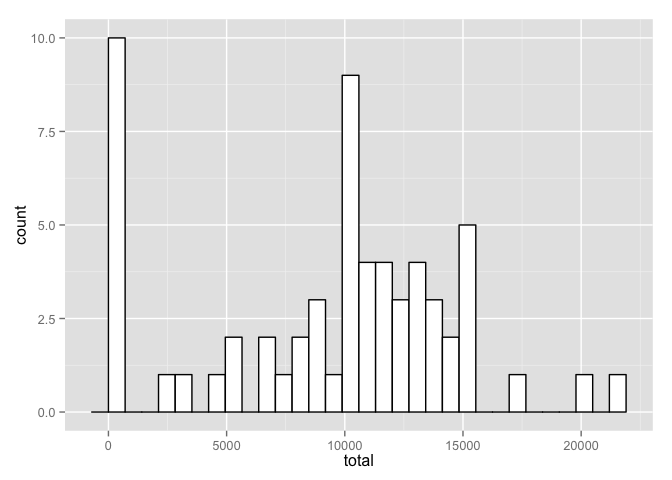
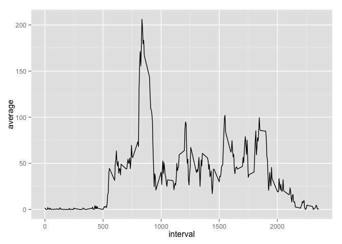
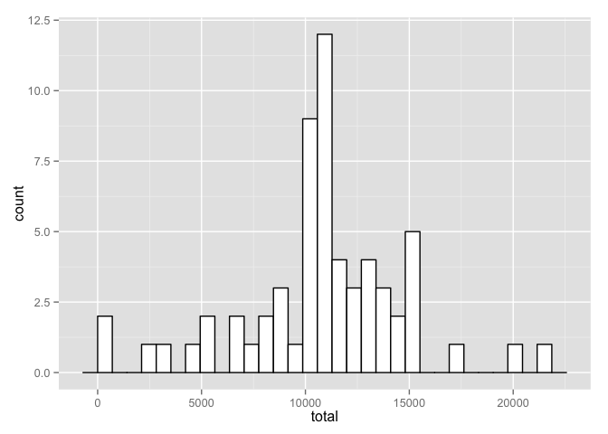
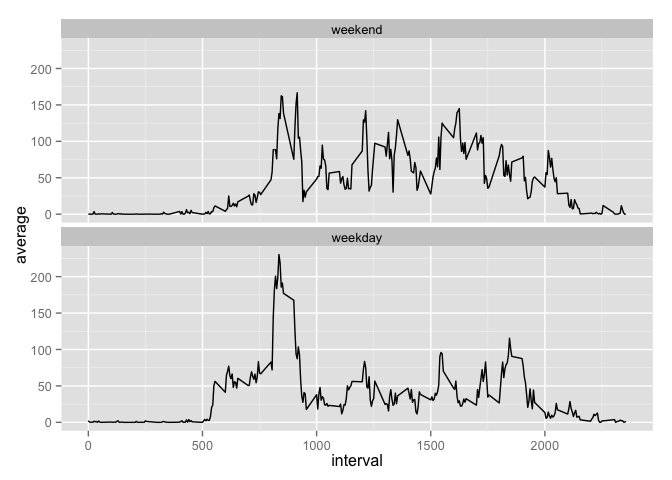

# Reproducible Research: Peer Assessment 1


## Loading and preprocessing the data


```r
setwd("/Users/soobrosa/RepData_PeerAssessment1")
data <- read.csv(unz("activity.zip", "activity.csv"))
```

I will use **dplyr** and **gplot2** throughout this analysis.

```r
library(dplyr)
```

```
## 
## Attaching package: 'dplyr'
## 
## The following object is masked from 'package:stats':
## 
##     filter
## 
## The following objects are masked from 'package:base':
## 
##     intersect, setdiff, setequal, union
```

```r
library(ggplot2)
```

## What is mean total number of steps taken per day?

Aggregate and plot:

```r
totals <- data %>%
  group_by(date) %>%
  summarise(total = sum(steps, na.rm = TRUE))

ggplot(totals, aes(x=total)) + geom_histogram(colour="black", fill="white")
```

```
## stat_bin: binwidth defaulted to range/30. Use 'binwidth = x' to adjust this.
```

 

The mean of the totals is:

```r
mean(totals$total)
```

```
## [1] 9354.23
```
The median of the totals is:

```r
median(totals$total)
```

```
## [1] 10395
```
## What is the average daily activity pattern?

Aggregate and plot:

```r
averages <- data %>%
  group_by(interval) %>%
  summarise(average = mean(steps, na.rm = TRUE))

ggplot(averages, aes(interval, average)) + geom_line()
```

 

The 5-minute interval containing the maximum number of steps is:

```r
averages[averages$average == max(averages$average), ]['interval']
```

```
## Source: local data frame [1 x 1]
## 
##   interval
## 1      835
```

## Imputing missing values

The total number of missing values in the dataset is:

```r
sum(!complete.cases(data)) 
```

```
## [1] 2304
```

My strategy for filling in all of the missing values in the dataset is using the the mean for the 5-minute interval.

Creating the new dataset

```r
data$average <- inner_join(data, averages)[, 4]
```

```
## Joining by: "interval"
```

```r
imputed <- data %>%
  mutate(steps = ifelse(is.na(steps), average, steps)) %>%
  select(-average)
```

Aggregate and plot:

```r
filled <- imputed %>%
  group_by(date) %>%
  summarise(total = sum(steps, na.rm = TRUE))

ggplot(filled, aes(x=total)) + geom_histogram(colour="black", fill="white")
```

```
## stat_bin: binwidth defaulted to range/30. Use 'binwidth = x' to adjust this.
```

 

The mean of the totals is:

```r
mean(filled$total)
```

```
## [1] 10766.19
```
The median of the totals is:

```r
median(filled$total)
```

```
## [1] 10766.19
```

Imputing distorted the measurements upwards and crammed mean and median together and made the total daily number of steps higher.

## Are there differences in activity patterns between weekdays and weekends?

Add a new column that differentiates between weekdays and weekends:

```r
imputed$date <- as.Date(imputed$date)
workweek <- c('Monday', 'Tuesday', 'Wednesday', 'Thursday', 'Friday')
imputed$weekpart <-factor((weekdays(imputed$date) %in% workweek)+1L, levels=1:2, labels=c('weekend', 'weekday'))
```

Aggregate and plot:

```r
comparison <- imputed %>%
  group_by(weekpart, interval) %>%
  summarise(average = mean(steps, na.rm = TRUE))

ggplot(comparison, aes(interval, average )) + geom_line() + facet_wrap( ~ weekpart, ncol = 1)
```

 

The steps taken on weekends are more even and generally more in absolute terms.
