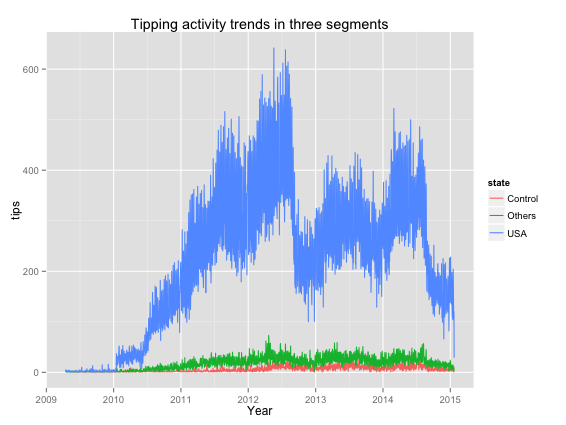

Is Yelp international?
========================================================
author: Daniel Molnar
date: 11-19-2015

Introduction
========================================================

The German Qype sold to Yelp in 2012. 

Did this make Yelp international?

Was this a good deal for Yelp? 

Methods
========================================================

* solve in the command line,
* compare US and control sample of cities,
* linear regression between reviewing and tipping activity and time.

Results
========================================================

 

Discussion
========================================================

Charting the change of user generated content does not show a rosy picture. The non-US control is way less productive than the US group and no specific uptick happened at the acquisition.
